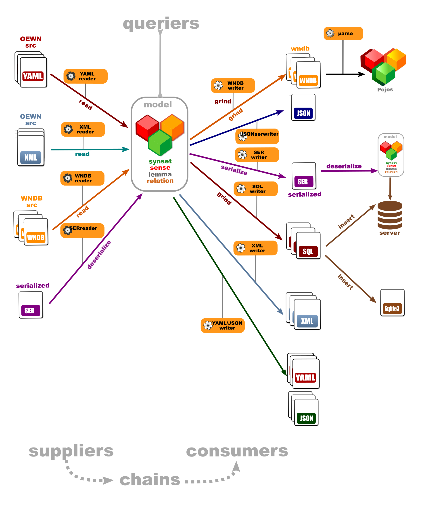
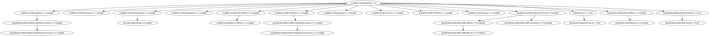

# Open English Wordnet grind

This project chains suppliers and consumers of Open English Wordnet models.

## Dataflow

## Modules

**Model**

- [model](http://github.com/oewntk/model) : Model

**Suppliers**: YAML,XML,WNDB,serialized

- [fromyaml](http://github.com/oewntk/fromyaml) : Supply model from YAML/JSON
- [fromxml](http://github.com/oewntk/fromxml) : Supply model from XML
- [fromwndb](http://github.com/oewntk/fromwndb) : Supply model from WNDB
- [fromser](http://github.com/oewntk/fromser) : Supply model from serialized model

**Consumers**: WNDB,SQL,serialized

- [towndb](http://github.com/oewntk/towndb)  : Consume model to WNDB
- [tosql](http://github.com/oewntk/tosql) : Consume model to to SQL
- [toser](http://github.com/oewntk/toser) : Consume model to serialized model
- [tojson](http://github.com/oewntk/tojson) : Consume model to serialized JSON model
- [toyaml](http://github.com/oewntk/toyaml) : Consume model to YAML/JSON

**Supplier-consumer chain**:

- [grind](http://github.com/oewntk/grind) : Multitool chaining supplier to consumer

## Command line

`grind.sh [options] source (source2) output`

#### Command line arguments

| arg       | type    | short | long       | definition                       | default   |
|-----------|---------|-------|------------|----------------------------------|-----------|
| in        | String  |       |            | Input dir or file                |           |
| out       | String  |       |            | Output dir or file               |           |
| in2       | String  | i2    | in2        | Optional extra input dir or file | yaml2     |
| operation | String  | do    | operation  | Operation                        | nothing   |
| inFormat  | String  | if    | in_format  | In format                        | yaml      |
| inPlus    | Boolean | p     | plus       | Plus input                       | false     |
| outFormat | String  | of    | out_format | Output format                    | yaml      |
| outInfo   | String  | i     | out_info   | Output info                      | oewn.info |
| outOne    | Boolean | 1     | out_one    | Output one file                  | false     |
| outMerge  | Boolean | m     | merge      | Do not group generated entries   | false     |
| verbose   | Boolean | v     | verbose    | Verbose output                   | false     |
 

## Maven Central

		<groupId>io.github.oewntk</groupId>
		<artifactId>grind</artifactId>
		<version>2.3.2</version>

## Dependencies

